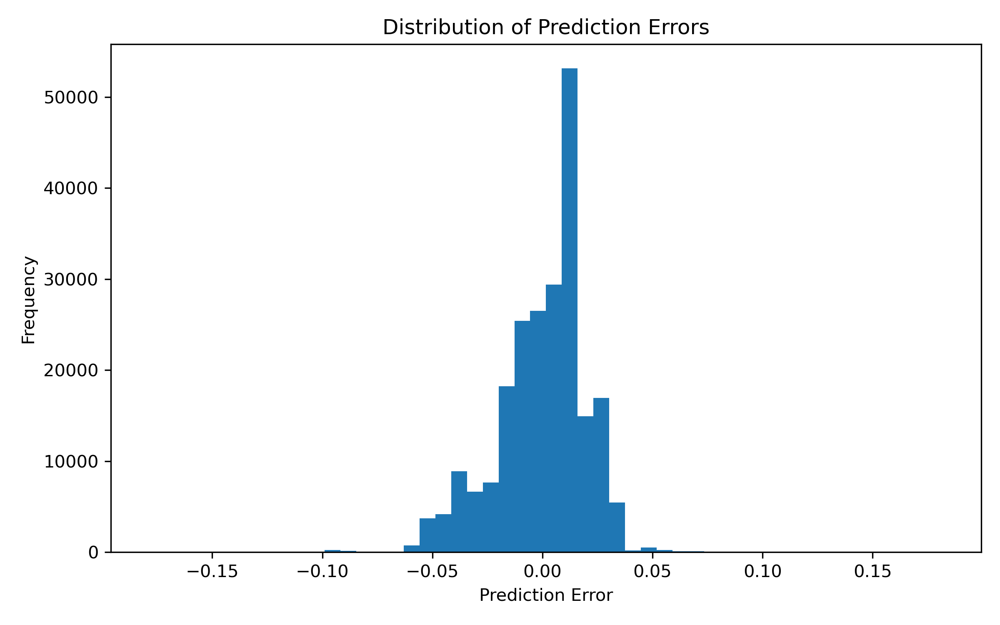
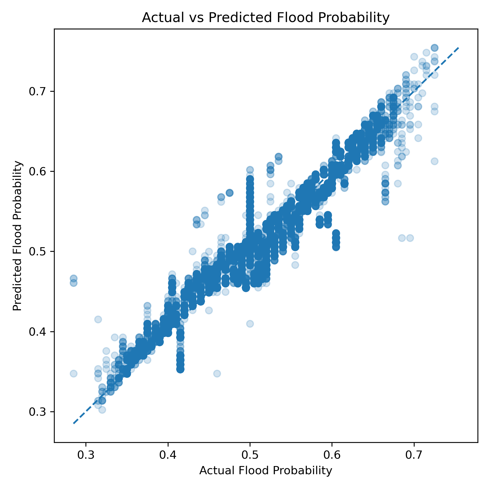
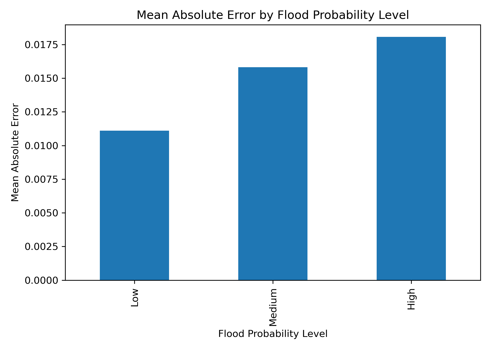
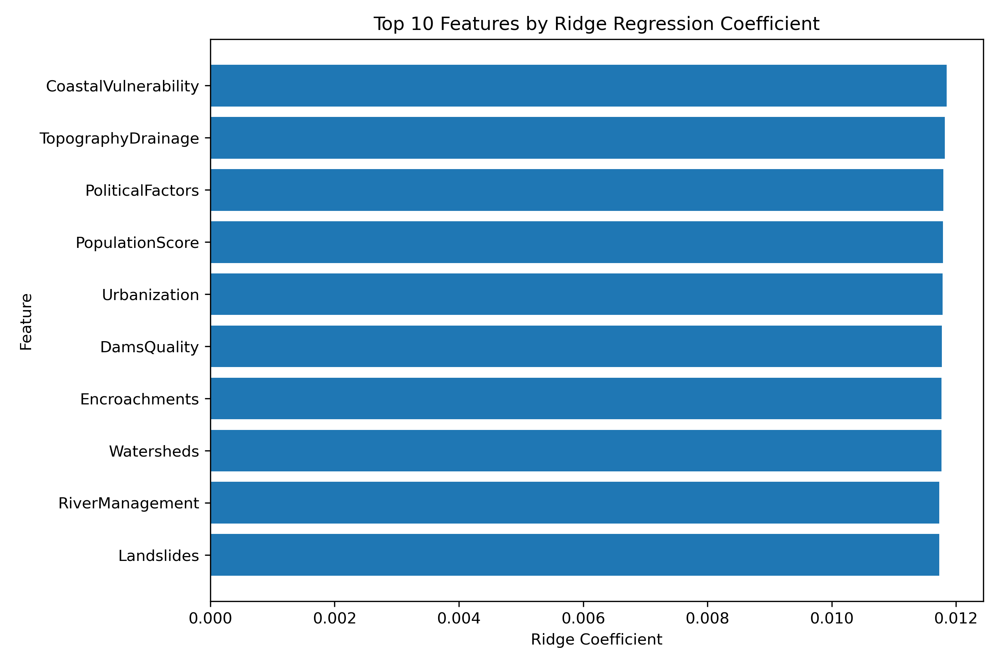

# Lily-Flood Risk Prediction Using Machine Learning

## Project Overview

This project is a machine learning prototype for flood-risk prediction using a structured Kaggle dataset. The goal is to practice a complete machine learning workflow, including data loading, model training, model evaluation, prediction, and basic error analysis.

This project is not an operational flood early-warning system. Instead, it is a learning prototype that connects machine learning with environmental risk analysis, disaster risk reduction, and climate adaptation.

## Motivation

Floods are one of the most serious climate-related disasters. Flood-risk analysis can support disaster risk reduction, infrastructure planning, emergency preparedness, and climate adaptation.

As a sustainability student interested in machine learning, GeoAI, water-related problems, and climate adaptation, I built this project as a first step toward applying data science to environmental risk analysis.

## Dataset

The dataset used in this project is the **Flood Prediction Dataset** from Kaggle:

https://www.kaggle.com/datasets/naiyakhalid/flood-prediction-dataset

The dataset contains structured indicators related to flood risk.

Example features include:

- Monsoon intensity
- Topography drainage
- River management
- Deforestation
- Urbanization
- Climate change
- Dam quality
- Drainage systems
- Infrastructure condition
- Disaster preparedness

The target variable is:
 `FloodProbability`

The raw dataset files are not included in this repository because they may be large. Please download the dataset from Kaggle and place the files in:

## Visual Analysis

### Error Distribution

The error distribution plot shows how prediction errors are distributed around zero. Most errors being close to zero indicates that the model makes relatively small mistakes for most validation samples.



### Actual vs Predicted Values

The actual-vs-predicted plot compares the true `FloodProbability` values with the model predictions. Points closer to the diagonal line indicate better predictions.



### Error by Flood Probability Level

This plot compares the mean absolute error across low, medium, and high flood-probability groups.



### Feature Importance

Feature importance was analyzed using Ridge Regression coefficients. Since the Ridge model uses standardized features, coefficient magnitudes can be compared across features.



```text
data/raw/